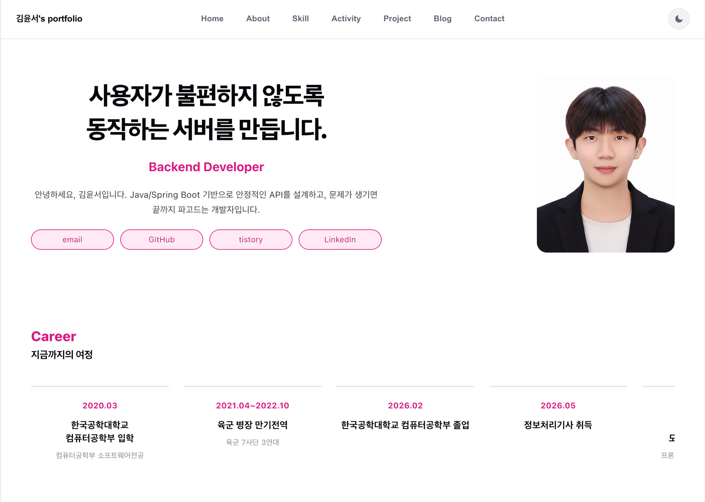
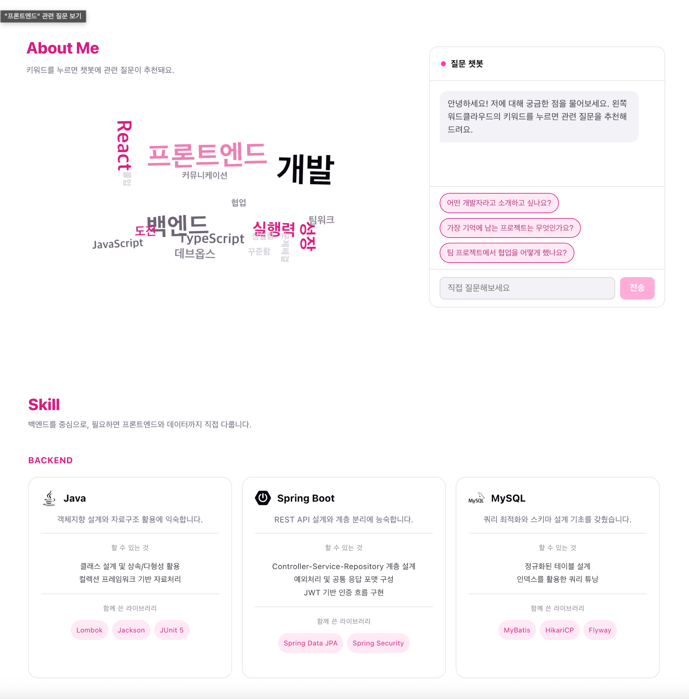
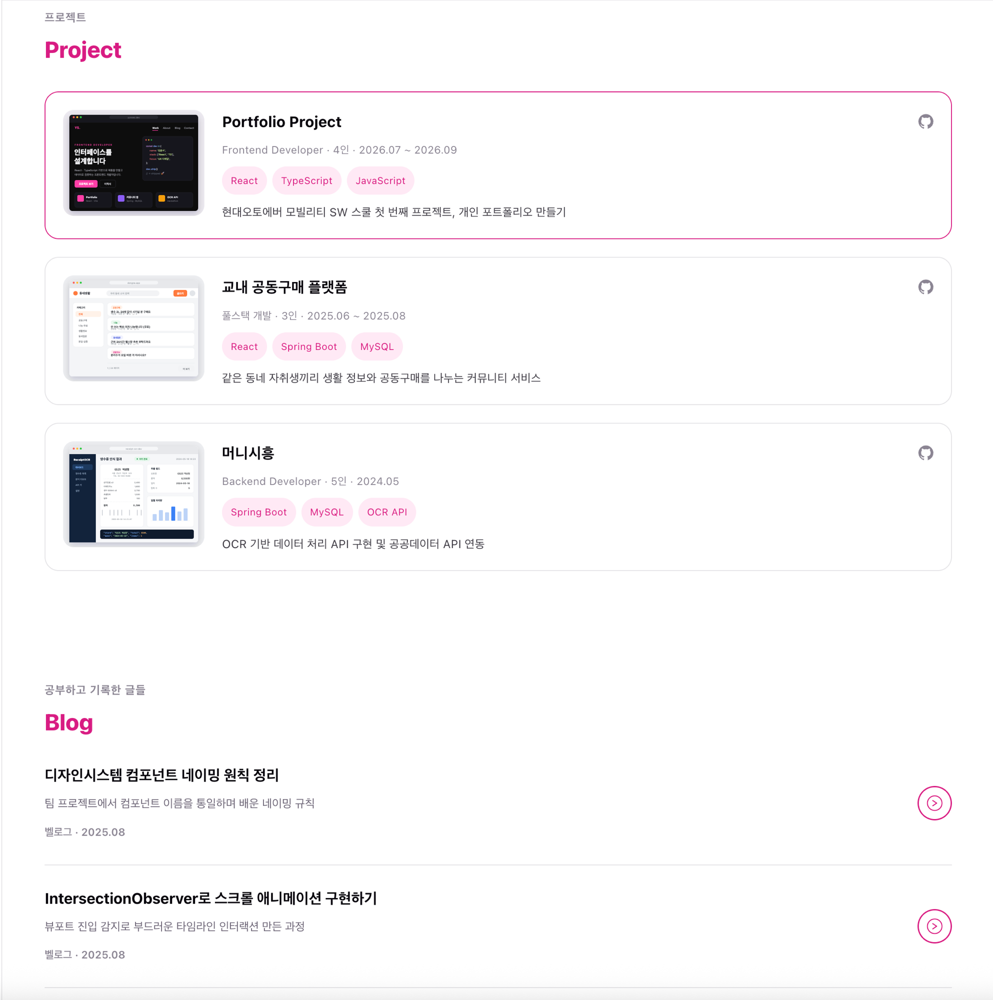

# 김윤서 포트폴리오

백엔드 개발자 김윤서의 개인 포트폴리오 웹사이트입니다.
현대오토에버 모빌리티 웹앱 데브캠프 4기 1차 개인 프로젝트로 만들었습니다.

**배포 주소** → https://kimyunseo-portfolio.vercel.app/

<br>

## 화면

| 홈 (Hero · Career) |
| --- |
|  |

| About (워드클라우드 · 챗봇) · Skill |
| --- |
|  |

| Project · Blog |
| --- |
|  |

<br>

## 소개

이력서를 그냥 나열하는 대신, 방문자가 궁금한 걸 눌러보고 물어보면서
읽을 수 있는 한 페이지짜리 사이트를 목표로 했습니다.

- 커리어 · 스킬 · 대외활동 · 프로젝트 · 블로그 글을 한 스크롤에 정리
- 콘텐츠는 코드가 아니라 Supabase 테이블에 두고 API 레이어로 읽어옴
- 워드클라우드 키워드를 누르면 챗봇이 그 주제에 맞는 추천 질문으로 바뀜
- 라이트 / 다크 테마 지원 (첫 방문은 시스템 설정을 따르고, 이후 선택을 localStorage에 저장)
- 데스크톱 / 모바일 반응형

<br>

## 주요 기능

### 키워드 → 챗봇 연동
About 섹션의 워드클라우드는 d3-cloud로 단어를 배치하고 CSS 애니메이션으로 은은하게 떠다니게 했습니다.
단어를 클릭하면 오른쪽 챗봇의 대화가 그 키워드용으로 초기화되고, `keyword_questions` 테이블에서
불러온 추천 질문 칩이 뜹니다. DB에 없는 키워드는 프론트에서 기본 문구를 만들어 대응합니다.

질문을 보내면 포트폴리오 데이터(커리어 · 프로젝트 · 대외활동 · 스킬)를 요약한 시스템 프롬프트와 함께
Gemini API를 호출해, 본인 1인칭으로 답하도록 했습니다. 시스템 프롬프트는 세션당 한 번만 만들어 캐시합니다.
API 키가 없으면 챗봇 UI는 그대로 두고 안내 문구만 반환합니다.

### 데이터 로딩
모든 섹션 데이터는 `useSupabaseQuery` 훅으로 가져옵니다.
컴포넌트는 `{ data, loading, error }`만 받아쓰고, 언마운트 이후 늦게 도착한 응답으로 상태를 바꾸지 않도록
cleanup 플래그로 막아뒀습니다.

<br>

## 기술 스택

| 구분 | 사용 기술 |
| --- | --- |
| 프레임워크 | React 19, TypeScript, Vite |
| 라우팅 | React Router |
| 데이터 | Supabase (PostgreSQL, RLS 읽기 전용 정책) |
| 시각화 | D3, d3-cloud |
| 챗봇 | Google Gemini API |
| 스타일 | CSS Modules, CSS 변수 기반 테마 |
| 아이콘 | react-icons |
| 배포 | Vercel |

<br>

## 프로젝트 구조

```
src/
├─ api/            # Supabase / Gemini 호출 함수 (career, projects, activities, skills, posts, chat ...)
├─ lib/            # supabase 클라이언트, 조회 훅, 테마 컨텍스트, 스크롤 유틸
├─ components/     # 섹션 단위 컴포넌트 (hero, career, wordcloud, chatbot, skill, activity, project, blog ...)
├─ pages/          # HomePage — 섹션들을 한 페이지로 조립
├─ types/          # 도메인 타입 정의
└─ styles/         # 전역 스타일

supabase/
└─ schema.sql      # 테이블 6개 + RLS 정책

public/            # 파비콘, 아이콘 스프라이트, 프로젝트 썸네일
docs/screenshots/  # README 이미지
```

### 데이터 모델 (`supabase/schema.sql`)

| 테이블 | 용도 |
| --- | --- |
| `career` | 학력 · 경력 타임라인 |
| `skills` | 카테고리별 스킬 카드 (할 수 있는 것 / 함께 쓴 라이브러리) |
| `activities` | 해커톤 · 공모전 · 스터디 등 대외활동 |
| `projects` | 프로젝트 카드 + 회고(개요 / 담당 / 구현 / 트러블슈팅 / 배운 점) |
| `posts` | 블로그(벨로그 · 노션) 글 목록과 본문 |
| `keyword_questions` | 워드클라우드 키워드별 챗봇 초기 메시지와 추천 질문 |

모든 테이블은 RLS를 켜고 `select`만 허용합니다. 쓰기는 Supabase 콘솔에서 직접 합니다.

<br>

## 로컬 실행

```bash
npm install
npm run dev
```

`.env.local` 파일이 필요합니다.

```bash
VITE_SUPABASE_URL=https://xxxx.supabase.co
VITE_SUPABASE_ANON_KEY=your-anon-key
VITE_GEMINI_API_KEY=your-gemini-key   # 없으면 챗봇은 안내 문구만 응답
```

Supabase 프로젝트를 새로 만든 경우 `supabase/schema.sql`을 SQL Editor에서 실행하면 테이블이 생성됩니다.

### 스크립트

| 명령 | 설명 |
| --- | --- |
| `npm run dev` | 개발 서버 |
| `npm run build` | 타입 체크 후 프로덕션 빌드 |
| `npm run preview` | 빌드 결과 미리보기 |
| `npm run lint` | oxlint |

<br>

## 배포

Vercel에 연결해 `main` 브랜치 푸시 시 자동 배포됩니다.
빌드 명령은 `npm run build`, 출력 디렉터리는 `dist`이며, 위 환경 변수는 Vercel 프로젝트 설정에 등록해뒀습니다.
